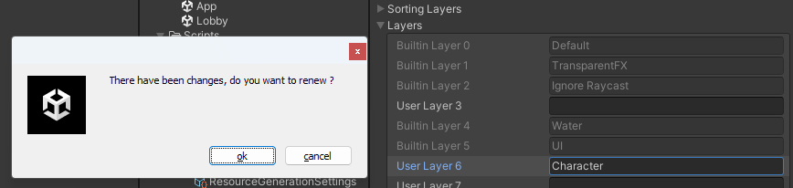
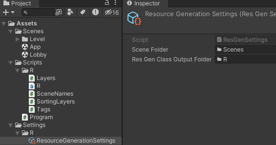
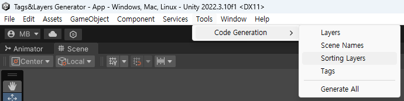

# R-for-Unity

A package contains generators that will generate classes containing the project's Layers, Tags, Sorting Layers and Scene Names for easy access.

inspired by Android's R class.

## Installation

### Install via git URL

To install this package, you need to edit your Unity project's `Packages/manifest.json` and add this repository as a dependency. 
``` json
{
  "dependencies": {
    "com.ez.r-for-unity": "https://github.com/ez8801/R-for-Unity.git",
  }
}
```

## Features
* Generate the project's Layers, Tags, Sorting Layers and Scene Names as classes.
* Detect to the file change and regenerate files



## First Step





## Usage

```CSharp
// Compare Layer
if (gameObject.CompareTag(R.LayerNames.Default))
{

}

// Raycast
var defaultLayer = 1 << R.Layers.Default;
Physics.Raycast(transform.position, Vector3.one, 10f, defaultLayer);

// Load Scene
SceneManager.LoadScene(R.SceneNames.Lobby);
```
